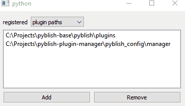

# pyblish-manager
🎵 do it like they do it on the VA-LI-DA-TION channel 🎵



a simple browser to visualise your current pyblish registration state.
great for debugging, or quickly adding new paths to test new plugins. 
hurray for browsing!

to spawn:
```python
from pyblish_manager import manager_GUI_widget
widget = manager_GUI_widget.make_config()
```
