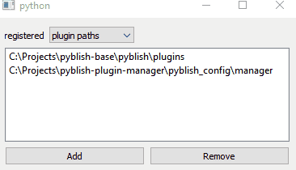

# pyblish-manager
🎵 do it like they do it on the VA-LI-DA-TION channel 🎵



A simple browser to visualise your current pyblish registration state.  
Great for debugging, or quickly adding new paths to test new plugins.   
Hurray for browsing!

## Install
```bash
python -m pip install git+https://github.com/hannesdelbeke/pyblish-manager
```

## Instructions
To show the window:
```python
from pyblish_manager import manager_GUI_widget
widget = manager_GUI_widget.make_config()
```

### Thank you
If this tool is helpfull, you can star it on the github page,  
just click the ⭐ star button in the top-right of this page. 🙏
